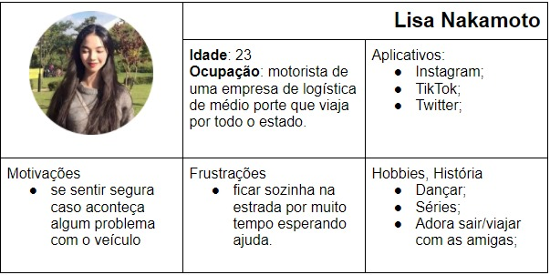
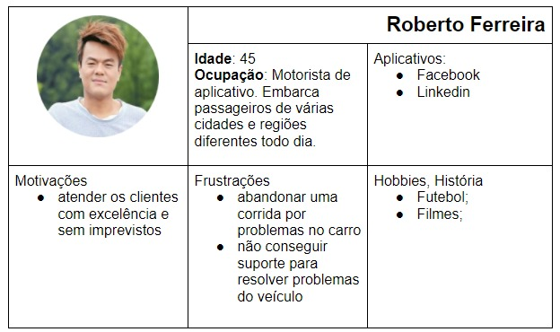
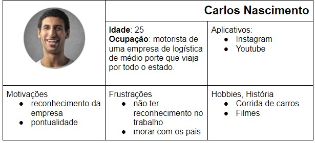
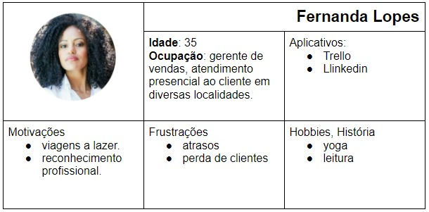
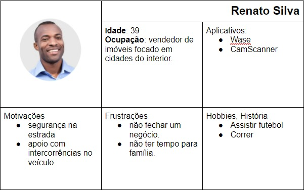

# Especificações do Projeto

Levando em consideração os fatores mencionados, torna-se necessário o desenvolvimento de uma aplicação que possa trazer comodidade e segurança para o condutor, construindo uma ferramenta que possa auxiliar na resolução de situações atípicas envolvendo o veículo e no cenário atual torna-se viável, pois além de ajudar o condutor, a aplicação estará contribuindo para o prestador angariar clientes e consequentemente ter um retorno financeiro. Atentando-se às necessidades dos condutores, o fator segurança também se destaca como uma das justificativas que corrobora com o intuito da aplicação.

## Personas

## Histórias de Usuários

Com base na análise das personas forma identificadas as seguintes histórias de usuários:

|EU COMO... `PERSONA`| QUERO/PRECISO ... `FUNCIONALIDADE`                 |PARA ... `MOTIVO/VALOR`                 |
|--------------------|----------------------------------------------------|----------------------------------------|
|Fernanda Lopes      | visitar vários clientes de forma efetiva e segura. | conseguir atender aos clientes sem atrasos ou com imprevistos minimizados.|
|Fernanda Lopes |conseguir resolver os imprevistos na estrada de forma rápida, prática e segura  |evitar impactos significativos no dia a dia que atrapalham sua jornada de trabalho |
 Renato Silva | apresentar vários imóveis para clientes, normalmente entre cidades pequenas | evitar atrasos ou minimizá-los.|situações atípicas que acontecem com o veículo impactam diretamente na qualidade do atendimento aos clientes.|
 Renato Silva|conseguir direcionamento fácil de como chegar em postos de gasolina, borracheiro ou serviços mecânicos|

Apresente aqui as histórias de usuário que são relevantes para o projeto de sua solução. As Histórias de Usuário consistem em uma ferramenta poderosa para a compreensão e elicitação dos requisitos funcionais e não funcionais da sua aplicação. Se possível, agrupe as histórias de usuário por contexto, para facilitar consultas recorrentes à essa parte do documento.

> **Links Úteis**:
> - [Histórias de usuários com exemplos e template](https://www.atlassian.com/br/agile/project-management/user-stories)
> - [Como escrever boas histórias de usuário (User Stories)](https://medium.com/vertice/como-escrever-boas-users-stories-hist%C3%B3rias-de-usu%C3%A1rios-b29c75043fac)
> - [User Stories: requisitos que humanos entendem](https://www.luiztools.com.br/post/user-stories-descricao-de-requisitos-que-humanos-entendem/)
> - [Histórias de Usuários: mais exemplos](https://www.reqview.com/doc/user-stories-example.html)
> - [9 Common User Story Mistakes](https://airfocus.com/blog/user-story-mistakes/)

## Requisitos

As tabelas que se seguem apresentam os requisitos funcionais e não funcionais que detalham o escopo do projeto.

### Requisitos Funcionais

|ID    | Descrição do Requisito  | Prioridade |
|------|-----------------------------------------|----|
|RF-001| O sistema permitirá aos usuários qse registrarem | ALTA | 
|RF-002| O sistema irá calcular o valor a ser cobrado do deslocamento realizado pelo prestador de serviço  | ALTA |
|RF-003| O sistema terá um chat de comunicação direta com o prestador de serviço| ALTA|
|RF-004| Serviço de solicitação para reabastecimento| MÉDIA|
|RF-005| O sistema permitirá ao usuário avaliar com estrelas e fazer comentários ao prestador de serviço| MÉDIA|
|RF-006| O sistema permitirá o gerenciamento das contas de usuários | ALTA|
|RF-007| O sistema irá possuir filtros para seleção de Comércios |ALTA|

### Requisitos não Funcionais

|ID     | Descrição do Requisito  |Prioridade |
|-------|-------------------------|----|
|RNF-001| O sistema deve ser responsivo permitindo a visualização em um celular de forma adequada | ALTA | 
|RNF-002| O sistema deverá ser compatível com os principais navegadores do mercado como (Google Chrome, Firefox, Microsoft Edge) | ALTA | 

Com base nas Histórias de Usuário, enumere os requisitos da sua solução. Classifique esses requisitos em dois grupos:

- [Requisitos Funcionais
 (RF)](https://pt.wikipedia.org/wiki/Requisito_funcional):
 correspondem a uma funcionalidade que deve estar presente na
  plataforma (ex: cadastro de usuário).
- [Requisitos Não Funcionais
  (RNF)](https://pt.wikipedia.org/wiki/Requisito_n%C3%A3o_funcional):
  correspondem a uma característica técnica, seja de usabilidade,
  desempenho, confiabilidade, segurança ou outro (ex: suporte a
  dispositivos iOS e Android).
Lembre-se que cada requisito deve corresponder à uma e somente uma
característica alvo da sua solução. Além disso, certifique-se de que
todos os aspectos capturados nas Histórias de Usuário foram cobertos.

## Restrições

O projeto está restrito pelos itens apresentados na tabela a seguir.

|ID| Restrição                                             |
|--|-------------------------------------------------------|
|01| O projeto deverá ser entregue no final do semestre letivo |
|02| O sistema deve se restringir às tecnologias solicitas para os requisitos do projeto |
|03| A equipe não pode  subcontratar o desenvolvimento do trabalho |

Enumere as restrições à sua solução. Lembre-se de que as restrições geralmente limitam a solução candidata.

> **Links Úteis**:
> - [O que são Requisitos Funcionais e Requisitos Não Funcionais?](https://codificar.com.br/requisitos-funcionais-nao-funcionais/)
> - [O que são requisitos funcionais e requisitos não funcionais?](https://analisederequisitos.com.br/requisitos-funcionais-e-requisitos-nao-funcionais-o-que-sao/)

## Diagrama de Casos de Uso

O diagrama de casos de uso é o próximo passo após a elicitação de requisitos, que utiliza um modelo gráfico e uma tabela com as descrições sucintas dos casos de uso e dos atores. Ele contempla a fronteira do sistema e o detalhamento dos requisitos funcionais com a indicação dos atores, casos de uso e seus relacionamentos. 

As referências abaixo irão auxiliá-lo na geração do artefato “Diagrama de Casos de Uso”.

> **Links Úteis**:
> - [Criando Casos de Uso](https://www.ibm.com/docs/pt-br/elm/6.0?topic=requirements-creating-use-cases)
> - [Como Criar Diagrama de Caso de Uso: Tutorial Passo a Passo](https://gitmind.com/pt/fazer-diagrama-de-caso-uso.html/)
> - [Lucidchart](https://www.lucidchart.com/)
> - [Astah](https://astah.net/)
> - [Diagrams](https://app.diagrams.net/)

Tabela do diagrama de casos de uso
|  |                                                       |
|--|-------------------------------------------------------|
|Registrar-se | Cadastro de usuários e prestadores de serviços que terão acesso ao sistema |
|Efetuar login| Autenticação de usuários e prestadores que terão acesso ao sistema  |
|Pesquisar locais específicos| Ferramenta de filtro de buscas que os usuários poderão utilizar para pesquisar locais em específicos|
|Gerenciar usuários| Controle do comportamento dos usuários no sistema|
|Gerenciar Prestadores| Controle do comportamento dos  prestadores de serviços no sistema |

Tabela de atores e suas definições
|  |                                                       |
|--|-------------------------------------------------------|
|Usuário | Motorista que necessita de prestação de serviços automotivos   |
|Prestador de serviço| Profissional da área automotiva  |
|Administrador| Pessoa responsável por gerenciar o sistema, usuários e prestadores de serviço |

Diagrama

