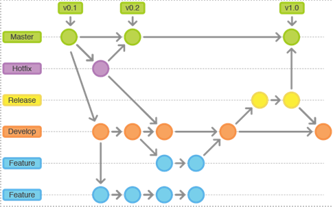

# Metodologia

A metodologia contempla as definições de ferramental utilizado pela equipe tanto para a manutenção dos códigos e demais artefatos quanto para a organização do time na execução das tarefas do projeto.

## Relação de Ambiente de Trabalho

Os artefatos do projeto são desenvolvidos a partir de diversas plataformas e a relação dos ambientes com seu respectivo propósito é apresentada na tabela que se segue. 

> **Links Úteis**:

> https://github.com/ICEI-PUC-Minas-PMV-ADS/pmv-ads-2021-2-e2-proj-int-t2-app-help
> 
> https://www.figma.com/file/DOCxZmvBGWwBiDFcS1EELF/Untitled?node-id=0%3A1
> 
> Quadro backlog hospedado no github

## Gestão de Código Fonte

Para gestão do código fonte do software desenvolvido pela equipe, o grupo utiliza um processo baseado no Git Flow abordado por Vietro (2015), mostrado na Figura a seguir. Desta forma, todas as manutenções no código são realizadas em branches separados, identificados como Hotfix, Release, Develop e Feature. Uma explicação rápida sobre este processo é apresentada no vídeo "The gitflow workflow - in less than 5 mins".

## Gerenciamento do Projeto

A equipe utiliza metodologias ágeis, tendo escolhido o Scrum como base para definição do processo de desenvolvimento.

A equipe está organizada da seguinte maneira:

●	Scrum Master: Alessandra Miria

●	Product Owner: Gerald Gabriel

●	Equipe de Desenvolvimento

○	Alessandra Miria

○	Alex Costa

○	Gustavo Luiz

○	Gerald Gabriel

○	Rafael Silva 

○	Rafael Augusto

●	Equipe de Design

○	Alessandra Miria

Para organização e distribuição das tarefas do projeto, a equipe está utilizando o Trello estruturado com as seguintes listas: 

●	Recursos: esta lista mantém template de tarefas recorrentes com as configurações padronizadas que todos devem seguir. O objetivo é permitir a cópia destes templates para agilizar a criação de novos cartões.

●	Backlog: recebe as tarefas a serem trabalhadas e representa o Product Backlog. Todas as atividades identificadas no decorrer do projeto também devem ser incorporadas a esta lista.

●	To Do: Esta lista representa o Sprint Backlog. Este é o Sprint atual que estamos trabalhando.

●	Doing: Quando uma tarefa tiver sido iniciada, ela é movida para cá.

●	Test: Checagem de Qualidade. Quando as tarefas são concluídas, eles são movidas para o “CQ”. No final da semana, eu revejo essa lista para garantir que tudo saiu perfeito.

●	Done: nesta lista são colocadas as tarefas que passaram pelos testes e controle de qualidade e estão prontos para ser entregues ao usuário. Não há mais edições ou revisões necessárias, ele está agendado e pronto para a ação.

●	Locked: Quando alguma coisa impede a conclusão da tarefa, ela é movida para esta lista juntamente com um comentário sobre o que está travando a tarefa.

Imagem de backlog 
Backlog.png

⦁	Documentação
⦁	Desenvolvimento 
⦁	Infraestrutura
⦁	Testes
⦁	Gerência de Projetos.
