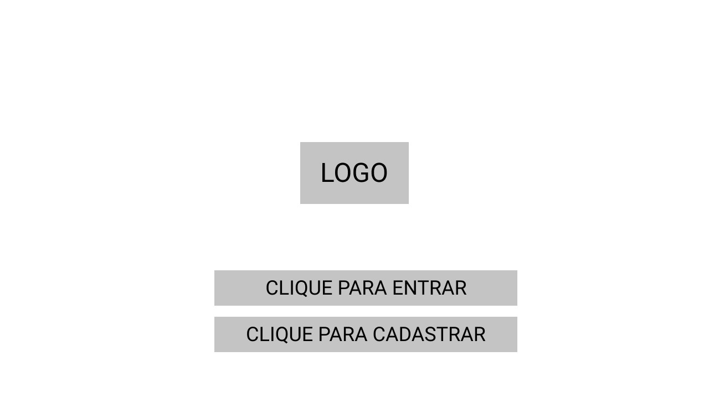
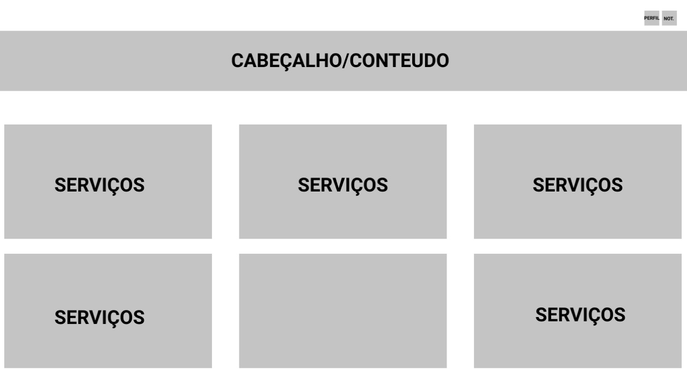
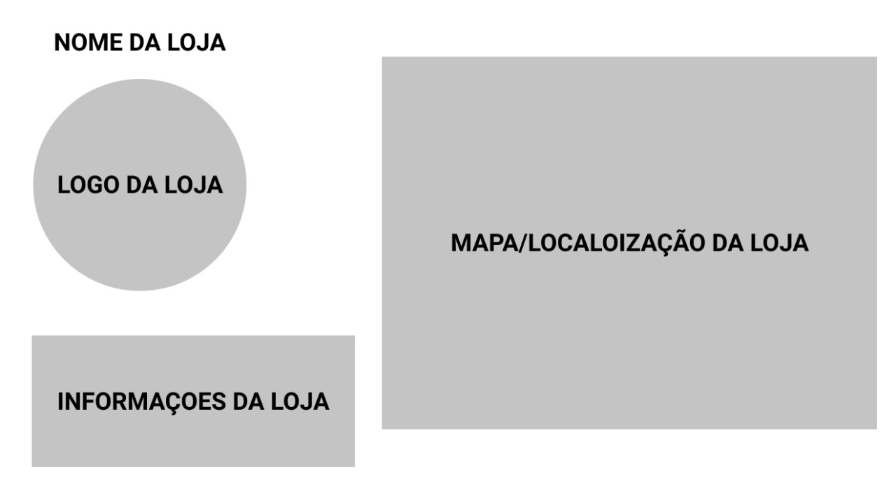

# Projeto de Interface

Pré-requisitos: <a href="2-Especificação do Projeto.md"> Documentação de Especificação</a>

Visão geral da interação do usuário pelas telas do sistema e protótipo interativo das telas com as funcionalidades que fazem parte do sistema (wireframes).

 Apresente as principais interfaces da plataforma. Discuta como ela foi elaborada de forma a atender os requisitos funcionais, não funcionais e histórias de usuário abordados nas <a href="2-Especificação do Projeto.md"> Documentação de Especificação</a>.

## Diagrama de Fluxo

O diagrama apresenta o estudo do fluxo de interação do usuário com o sistema interativo e  muitas vezes sem a necessidade do desenho do design das telas da interface. Isso permite que o design das interações seja bem planejado e gere impacto na qualidade no design do wireframe interativo que será desenvolvido logo em seguida.

O diagrama de fluxo pode ser desenvolvido com “boxes” que possuem internamente a indicação dos principais elementos de interface - tais como menus e acessos - e funcionalidades, tais como editar, pesquisar, filtrar, configurar - e a conexão entre esses boxes a partir do processo de interação. Você pode ver mais explicações e exemplos https://www.lucidchart.com/blog/how-to-make-a-user-flow-diagram.

As referências abaixo irão auxiliá-lo na geração do artefato “Diagramas de Fluxo”.

> **Links Úteis**:
> - [Fluxograma online: seis sites para fazer gráfico sem instalar nada | Produtividade | TechTudo](https://www.techtudo.com.br/listas/2019/03/fluxograma-online-seis-sites-para-fazer-grafico-sem-instalar-nada.ghtml)

## Wireframes

## Tela de Login

Conforme fluxo de telas do projeto, apresentado no item anterior, as telas do sistema são apresentadas em detalhes nos itens que se seguem. As telas do sistema apresentam uma estrutura comum que é apresentada na Figura X. Nesta estrutura, existem 3 grandes blocos, descritos a seguir. São eles:

● Logo - Logotipo do Sistema;

● Entrar - O usuário fazer o login, se possuir conta ja existente para usar a aplicação;

● Registrar - O usuário que não obtiver conta, fazer o cadastro imediato para poder usar a aplicação.

 
 ## Tela Inicial do Usuário
 
 Tela inicial que o usuário obterá estas informações ao logar em sua conta. Com base na estrutura padrão o bloco Conteúdo traz os serviços disponiveis naquela região.
 
 ● O componente Cabeçalho nos mostra 2 elementos: Perfil do usuário onde pode ver suas informações cadastrais, barra de pesquisa para que possa pesquisar um serviço/ou prestador de serviços específico.
 
 
 
 ## Tela de Serviços do Usuário 
 
 A Tela de Serviços nos traz quando o usuário escolhe um serviço ou um prestador para lhe atender, podemos ver assim na tela. 
 
 ● Cabeçalho: nome da Loja (Prestador do serviço) e a logo da mesma;
 
 ● Conteúdo: Mapa de localização (onde a loja esta localizada);
 
 ● Rodapé: Informações do prestador de serviços, como número, CNPJ/CPF, e-mail, entre outros.
 
 
 

