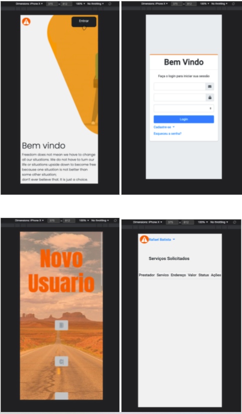

# Registro de Testes de Usabilidade

## Teste 1
Objetivo: Verificar se o usuário consegue se cadastrar  no sistema

Usuário: Ricardo Braga, 26 anos, motorista de aplicativo de transporte de usuário.

Tarefa: Acessar a página inicial e clicar no botão Entrar, em seguida Cadastre-se e escolha a opção Usuário. Preencher as informações como Nome, CPF, Data de Nascimento, E-mail, Senha, Chassi, Endereço, Bairro, Cidade, Estado (informações que são obrigatórias para o cadastro) e clicar em Salvar.

Observações: o usuário conseguiu seguir os passos sem empecilhos e conseguiu executar a tarefa com êxito. Após o cadastro a aplicação não apresentou mais nenhuma ação e o usuário precisou voltar para tela inicial manualmente.

## Teste 2
Objetivo: Verificar se o usuário consegue acessar o sistema após ter feito o cadastro com sucesso

Usuário: Patrícia Ferreira, 32 anos, representante de vendas.

Tarefa: Acessar a página inicial e clicar no botão entrar; Preencher as informações de login e senha, logo após, clicar no botão “entrar”

Observações: o usuário conseguiu seguir os passos sem empecilhos e conseguiu executar a tarefa com êxito.

## Teste 3
Objetivo: Verificar se o prestador consegue se cadastrar no sistema	

Usuário: Alípio de Melo, 55 anos, mecânico.

Tarefa: Acessar a página inicial e clicar no botão Entrar, em seguida Cadastre-se. Preencher as informações como Nome completo, CNPJ, E-mail, Senha, Tipo de Serviço, Nome do comércio, Valor Médio do Serviço (informações que são obrigatórias para o cadastro) e clicar em Salvar.

Observações: o usuário conseguiu seguir os passos sem empecilhos e conseguiu executar a tarefa com êxito. Após o cadastro a aplicação não apresentou mais nenhuma ação e o usuário precisou voltar para tela inicial manualmente.

## Teste 4
Objetivo: Verificar se o prestador consegue acessar o sistema após ter feito o cadastro com sucesso	

Usuário: Antônio Nunes, 37 anos, borracheiro e eletricista.	

Tarefa: Acessar a página inicial e clicar no botão Entrar; Preencher as informações de login e senha, logo após, clicar no botão “login”.

Observações: o usuário conseguiu seguir os passos sem empecilhos e conseguiu executar a tarefa com êxito.

## Teste 5
Objetivo: Verificar se o usuário consegue pesquisar um prestador/serviço	

Usuário: Geraldo Silva, 50 anos, motorista de caminhão de uma empresa de logística. 	

Tarefa: Acessar a página inicial e clicar no botão Entrar; Preencher as informações de login e senha; Clicar no botão “login", clicar no botão Serviços e pesquisar o serviço desejado no campo de "Buscar Serviços"

Observações: o usuário conseguiu seguir os passos sem empecilhos e conseguiu executar a tarefa com êxito.

## Teste 6
Objetivo: Verificar se o sistema é responsivo em smartphones	

Usuário: Ana Clara Martins, 18 anos, estudante.

Tarefa: Acessar a página inicial pelo smartphone; Preencher as informações de login e senha; Clicar no botão “entrar”; Verificar página principal; Verificar se as informações estão ordenadas de uma forma clara na tela do smartphone.

Observações: algumas páginas como “Novo Usuário” e “Serviços Solicitados” não foram apresentadas corretamente na tela do smartphone.

## Considerações finais
Com base nas observações dos testes, será necessário fazer algumas alterações, para melhorar a usabilidade do usuário. A responsividade precisa de atenção, pois a aplicação foi projetada para ser utlizada em qualquer plataforma. Além disso, algumas ações são necessárias que o usário consiga utilizar a plataforma com mais facilidade. Nos testes 1 e 3 foi observado a necessidade de implementar uma ação para que o usuário ao terminar de fazer o cadastro, retornar para a página inicial ou de autenticação. Em relação ao teste 6, recomenda-se a adequação das telas em que a responsividade não está adequada, caso contrário não será possível a utilização da plataforma em smarthphones. Por hora, a aplicação é viável apenas para utlização em desktops. 

